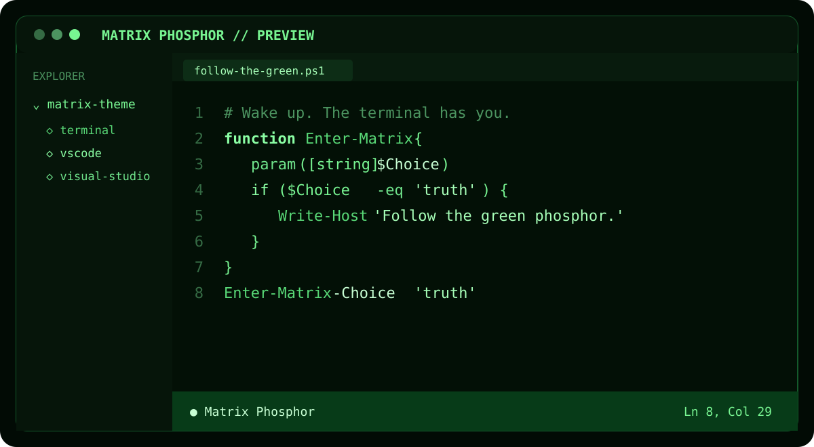

# Matrix Phosphor Theme



A phosphor-green theme inspired by the terminal aesthetic of *The Matrix*. The original terminal palette is available for Windows Terminal/PowerShell, while the IDE variants use a black-first palette in Visual Studio Code, Visual Studio, and SQL Server Management Studio 22.

> This is an unofficial fan-made theme and is not affiliated with or endorsed by Warner Bros., Village Roadshow Pictures, or the creators of *The Matrix*.

## Theme characteristics

- True-black IDE backgrounds with restrained near-black secondary surfaces
- The Windows Terminal/PowerShell palette remains unchanged from version 0.1.0
- Phosphor-green text and accents with brightness-based syntax separation
- Dark green comments, electric-green control keywords, pale-green types, and mint-white literals/constants
- Mint-white highlights for literals, constants, and selected language symbols
- Heavier, readable terminal typography
- No telemetry, network requests, executable extension code, services, or background tasks

## Preview status

| Product | Status | Distribution |
| --- | --- | --- |
| Windows Terminal / PowerShell | Tested on Windows Terminal 1.24 | User-local JSON fragment |
| Visual Studio Code | Preview | Declarative color-theme VSIX |
| Visual Studio 2022 and 2026 | Preview | Theme-only VSIX |
| SQL Server Management Studio 22 | Preview | Theme-only VSIX |
| Notepad++ 8.9.7 | Preview | User-local XML theme |

The IDE variants are intentionally marked as previews while their language and tool-window coverage is evaluated in daily use.

## Windows Terminal and PowerShell

Run from PowerShell:

```powershell
.\scripts\Install-MatrixTheme.ps1
```

Close every Windows Terminal window and reopen it. The theme applies to the built-in **Windows PowerShell** and **PowerShell** profiles.

The installer uses the per-user Windows Terminal fragment directory and does not rewrite your personal `settings.json`:

```text
%LOCALAPPDATA%\Microsoft\Windows Terminal\Fragments\MatrixTheme\matrix-theme.json
```

To remove it:

```powershell
.\scripts\Uninstall-MatrixTheme.ps1
```

## Visual Studio Code preview

Build the extension package:

```powershell
.\scripts\Build-Themes.ps1 -SkipVisualStudio
```

Install the generated package:

```powershell
code --install-extension .\artifacts\matrix-phosphor-theme-0.3.0.vsix
```

Then select **Preferences: Color Theme > Matrix Phosphor**.

The VS Code extension is declarative: it contains a manifest and color definitions, with no JavaScript or executable extension host code.

## Visual Studio and SSMS preview

Build both packages on a machine with the Visual Studio extension development workload and .NET Framework 4.7.2 targeting pack:

```powershell
.\scripts\Build-Themes.ps1
```

The Visual Studio package is written to:

```text
artifacts\MatrixPhosphorTheme.vsix
```

Open it with the VSIX Installer, restart Visual Studio or SSMS, and select:

```text
Tools > Theme > Matrix Phosphor
```

The same theme-only VSIX targets Visual Studio 2022/2026 and SSMS 22. Close the target application before installation so its per-user extension cache can be updated safely.

The ready-to-paste Microsoft Marketplace copy is maintained in [MARKETPLACE.md](MARKETPLACE.md).

The committed `.pkgdef` is regenerated from a full-coverage Visual Studio `.pkgdef` reference and recolored with an independently defined Matrix palette. It contains 62 theme headers and 1,480 UI/classification items, including `Shell` and `ShellInternal` for the Visual Studio 2026 chrome plus explicit XML and SQL classifications:

```powershell
.\scripts\Update-VisualStudioTheme.ps1 -ReferencePkgdefPath C:\path\to\full-coverage-theme.pkgdef
```

The VS Code source is generated separately from a full-coverage JSON/JSONC reference:

```powershell
.\scripts\Generate-MatrixTheme.ps1 -ReferenceThemePath C:\path\to\reference-theme.jsonc
```

## Notepad++ preview

Run the installer from PowerShell:

```powershell
.\scripts\Install-NotepadPlusPlusTheme.ps1
```

The script regenerates the theme from the installed `DarkModeDefault.xml`, preserving the lexer coverage supported by the local Notepad++ version. It writes only the following user-level file and does not modify the built-in theme:

```text
%APPDATA%\Notepad++\themes\Matrix Phosphor.xml
```

Restart Notepad++ and select **Settings > Style Configurator > Select theme > Matrix Phosphor**. The committed theme was generated and tested with Notepad++ 8.9.7.

## Validation and privacy

Run all source checks before publishing:

```powershell
.\scripts\Test-PublicRepository.ps1
```

The validation rejects common secret formats, private-key material, user-profile paths, local build artifacts, and known personal identifiers. See [PRIVACY.md](PRIVACY.md) for the exact runtime behavior and data boundary.

## Project layout

```text
terminal/       Windows Terminal color scheme and profile fragment
vscode/         VS Code declarative theme extension
visual-studio/  Visual Studio and SSMS theme-only VSIX project
notepadplusplus/ Notepad++ XML theme
scripts/        Install, build, conversion, and public-safety checks
assets/         Repository-safe generated preview artwork
```

## License

MIT. See [LICENSE](LICENSE).
